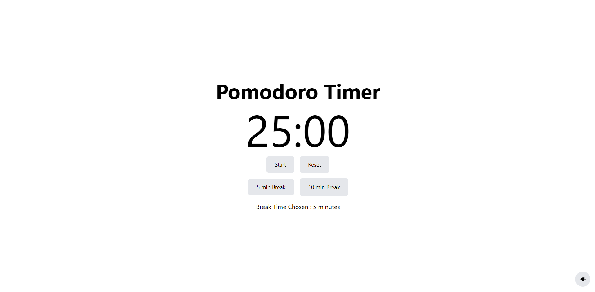
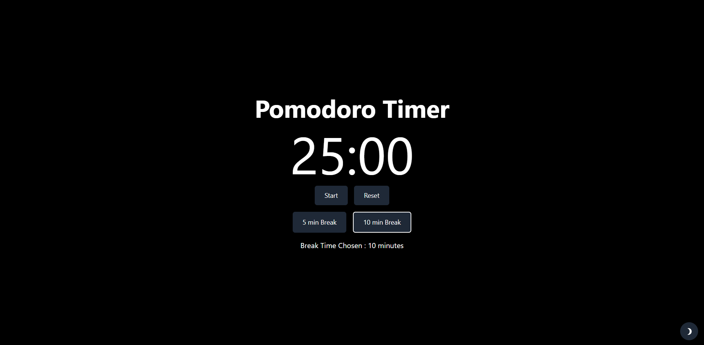
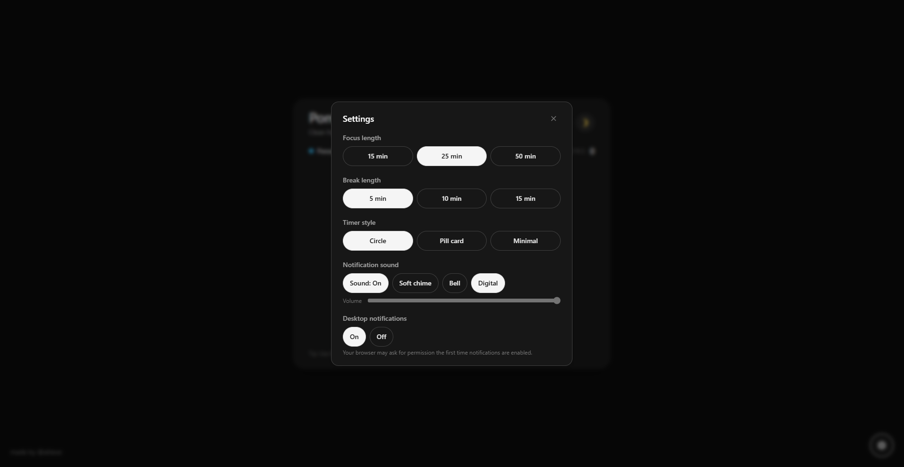

# Pomodoro Timer

A clean, minimal Pomodoro timer for the browser. Set a focus length, take breaks, and let the timer cycle automatically. All preferences are saved locally.

| Light | Dark | Settings |
|-------|------|----------|
|  |  |  |

## Features

**Timer**
- **Focus length** — 15, 25, or 50 minutes per session
- **Break length** — 5, 10, or 15 minutes
- **Auto cycle** — After focus → break; after break → next focus. No need to restart manually.
- **Session count** — Tracks completed focus sessions

**Customization**
- **Theme** — Light or dark; defaults to your system preference
- **Timer style** — Circle (with progress ring), Pill card, or Minimal
- **Notification sound** — On/off, with Soft chime, Bell, or Digital presets and a volume slider
- **Desktop notifications** — Optional browser notifications when a session or break ends

**Persistence** — Theme, durations, timer style, and notification settings are stored in `localStorage` and restored on reload.

## Tech stack

- **React 18** — UI
- **Vite** — Build and dev server
- **Tailwind CSS** — Styling
- **react-icons** — Icons

## Getting started

**Requirements:** Node.js 18+ and npm (or yarn/pnpm).

```bash
git clone <your-repo-url>
cd Pomodoro-Timer
npm install
npm run dev
```

Open [http://localhost:5173](http://localhost:5173). The timer is ready to use.

**Other commands**

| Command | Description |
|---------|-------------|
| `npm run dev` | Start dev server with HMR |
| `npm run build` | Production build (output in `dist/`) |
| `npm run preview` | Serve the production build locally |
| `npm run lint` | Run ESLint |

## License

MIT
